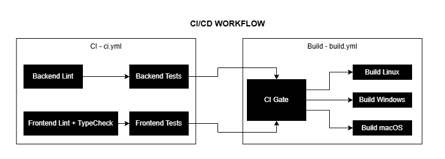

# AutoPattern — CI/CD

Este documento descreve o fluxo de Integração Contínua e Entrega Contínua (CI/CD) do projeto **AutoPattern**, além de instruções sobre como testar localmente as pipelines utilizando o `act` antes de enviar o código para o repositório.

## Fluxo de CI/CD
<div align="center">
  
</div>

O projeto conta com dois workflows principais do GitHub Actions, localizados na pasta `.github/workflows`:

### 1. CI | Lint & Test (`ci.yml`)
Garante a qualidade do código a cada nova modificação.
- **Gatilhos:** Executado a cada `push` e `pull_request` para a branch `main`.
- **Backend:**
  - **Lint & Formatter:** Utiliza o `ruff` para verificar e formatar o código Python.
  - **Testes:** Utiliza o `pytest` para a execução dos testes automatizados.
- **Frontend:**
  - **Lint & Typecheck:** Utiliza `eslint`, `prettier` e `tsc` para validar e garantir a tipagem do TypeScript.
  - **Testes:** Utiliza o `jest` para os testes unitários da interface.

### 2. Build | Electron App (`build.yml`)
Responsável pelo empacotamento do aplicativo Desktop.
- **Gatilho:** Acionado automaticamente apenas quando o workflow `ci.yml` for completado com **sucesso**.
- **Processo:** Executa o `electron-builder` criando as versões distribuíveis para **Linux**, **Windows** e **macOS**.

---

## Testando Workflows Localmente com o `act`

Para garantir que o seu código passa nas verificações sem precisar criar commits sujos e poluir o histórico do repositório remoto, utilizamos a ferramenta [act](https://nektosact.com/). O `act` roda os workflows do GitHub Actions localmente através de containers Docker.

### Pré-requisitos
1. [Docker](https://www.docker.com/) instalado e em execução (Docker Desktop).
2. [act CLI](https://github.com/nektos/act) instalado no seu sistema.

### Como realizar os Testes Locais

Abra o terminal na raiz do projeto e execute os comandos abaixo de acordo com a parte do sistema que você deseja validar. É recomendado fazer isso **antes de todo commit/push** para a branch principal.

#### 🐍 Backend (Python / FastAPI)
Para validar o estilo e a formatação do código:
```bash
act -j backend-lint
```
Para executar a suíte de testes (`pytest`):
```bash
act -j backend-test
```

#### ⚛️ Frontend (Electron / TypeScript)
Para validar erros do linter, prettier e checagem de tipos:
```bash
act -j frontend-lint
```
Para executar a suíte de testes do frontend (`jest`):
```bash
act -j frontend-test
```

#### 📦 Simulando o Build do App
O job de build depende do término e sucesso do workflow de CI. Para simulá-lo localmente via `act`, o projeto possui um arquivo configurado (`event.json`) que simula o payload de sucesso que o Github enviaria:
```bash
act -e event.json -j build
```
*(Nota: O `act` roda primariamente ambientes Linux/Ubuntu, então ele emulará a criação do instalador do Linux (`.AppImage`). A montagem para macOS e Windows será "skipada", mas já garante a integridade geral do build).*
