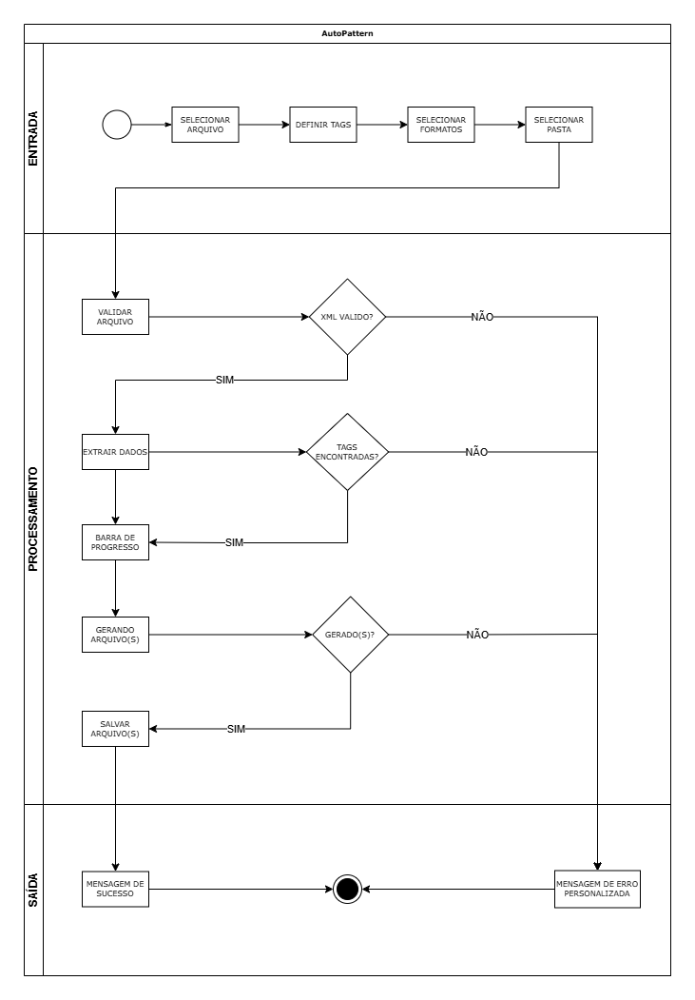

# AutoPattern

### Automação de Arquivos XML | DESKTOP

Software Desktop que automatiza arquivos <b>XML</b>, convertendo-os em <b>.xlsx</b> ou <b>.pdf</b>, gerando <b>planilha</b> ou <b>relatório</b> padronizados, facilitando a visualização ou busca de informações. Está aplicação tem o objetivo de economizar tempo e maximizar o entendimento de forma visual.

### Funcionalidades
- Seleção de arquivo XML
- Definição de tags/default (todas tags) para extração
- Opção de salvar em Excel (.xlsx)
- Opção de gerar relatório PDF (.pdf)
- Seleção do caminho para salvar arquivo(s)
- Barra de progresso com descrição da etapa atual

### Mensagens e Tratamento de Erros
- Arquivo XML inválido
- Tags não encontradas
- Erros ao salvar arquivos
- Erros de conexão ou comunicação
