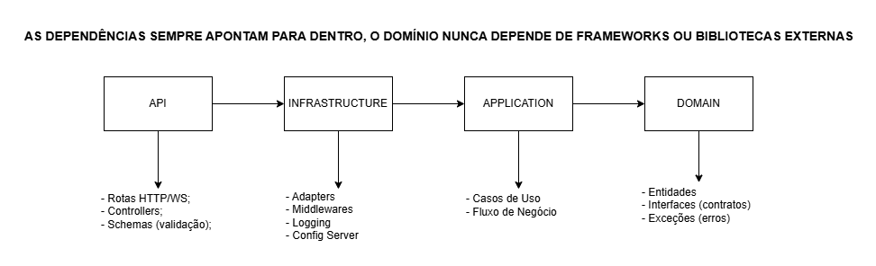
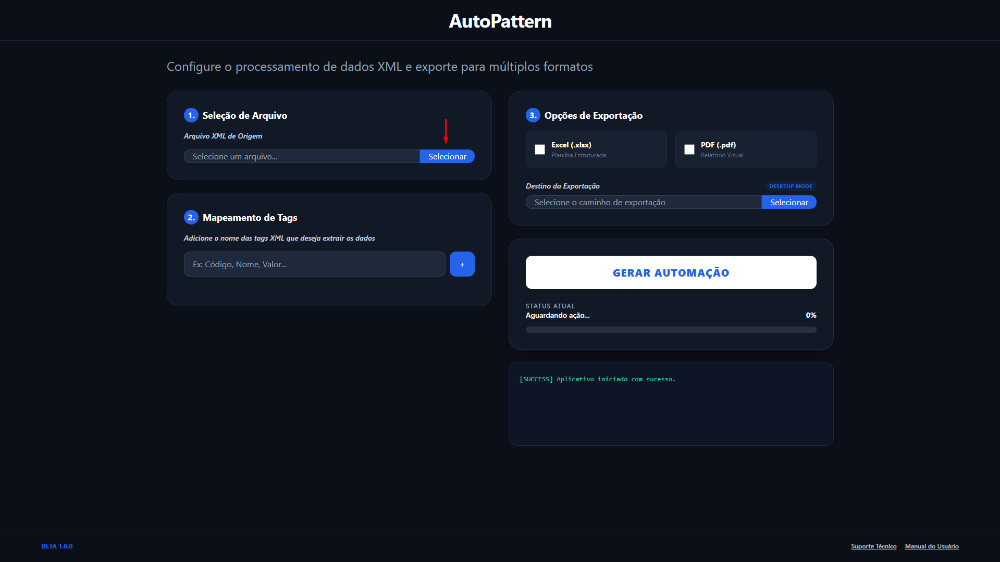
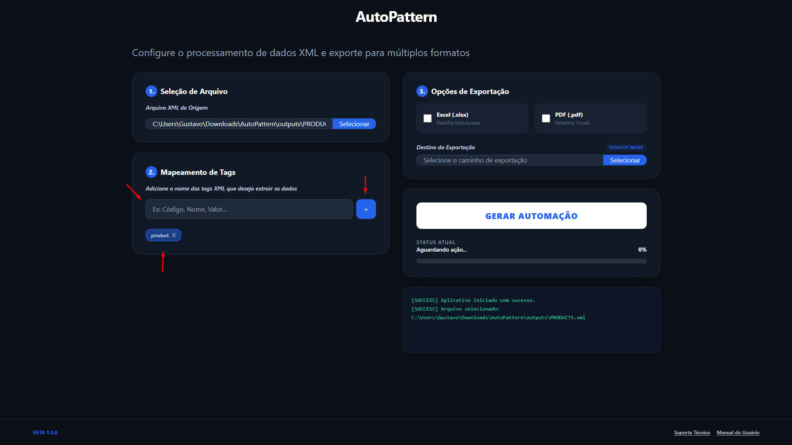
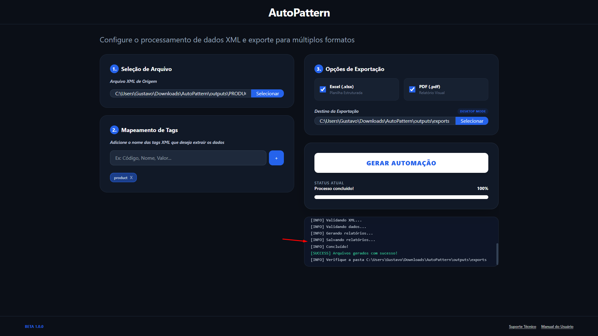
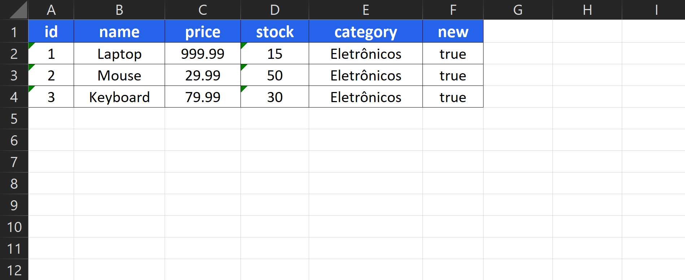
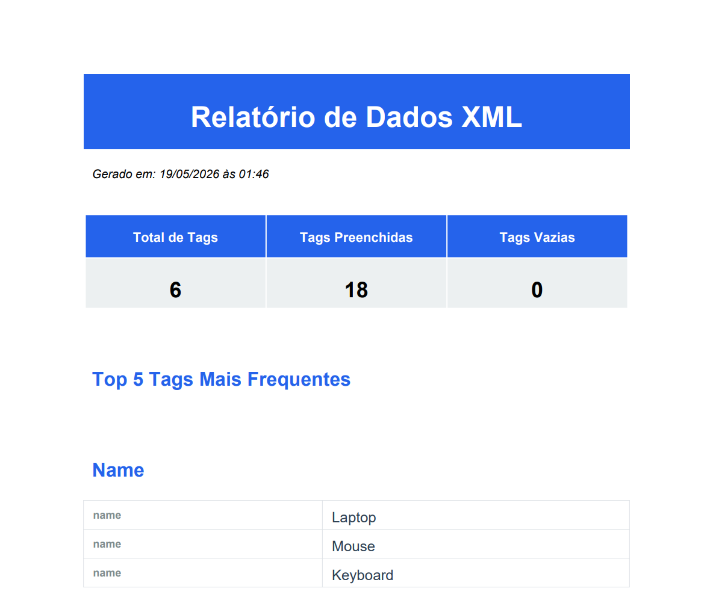
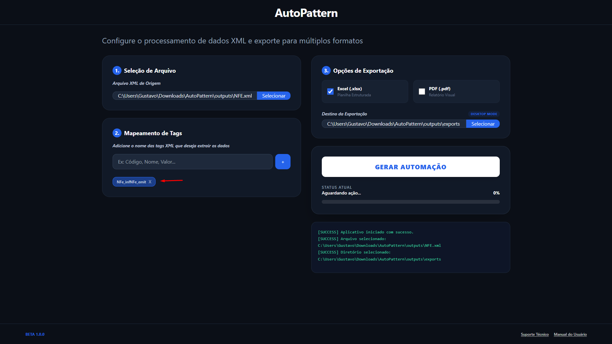
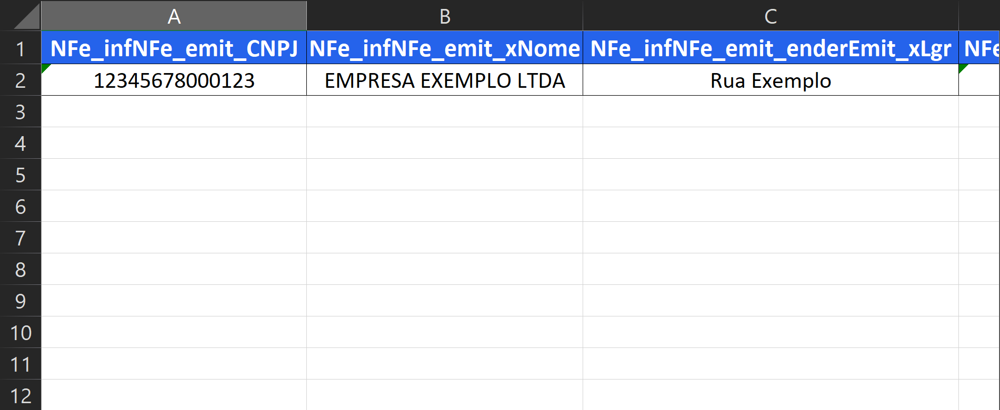

#   AutoPattern

<!-- Badges da Aplicação -->


[](LICENSE)


<!-- Badges de Engenharia e Tecnologias -->
[](https://blog.cleancoder.com/uncle-bob/2012/08/13/the-clean-architecture.html)
[](https://owasp.org/Top10/2025/)

[](https://www.python.org/downloads/release/python-3120/)
[](https://www.typescriptlang.org)
[](https://react.dev/)
[](https://electron-vite.org/)

**Automação inteligente de arquivos XML para relatórios visuais profissionais em segundos.**

> ⚠️ **Beta Release (1.0.0):** Esta aplicação encontra-se em fase de lançamento inicial e pode conter erros ou comportamentos inesperados. Feedbacks e relatórios de bugs são bem-vindos via [Issues](https://github.com/GustavoMartin2002/AutoPattern/issues).

---

## 🧭 Navegação da Documentação

- [O que é?](#o-que-é)
- [Funcionalidades Principais](#funcionalidades-principais)
- [Principais Tecnologias](#principais-tecnologias)
- [Estrutura do Projeto](#estrutura-do-projeto)
- [Documentação Completa (Hub)](#documentação-completa-hub)
- [Início Rápido](#início-rápido)
- [Manual do Usuário](#manual-do-usuário)

---

## O que é?

O **AutoPattern** é uma aplicação **Desktop** monolítica robusta construída para resolver a complexidade de leitura de arquivos **XML** massivos. Processa, filtra e extrai hierarquias profundas de dados ou notas fiscais, convertendo-os instantaneamente em **planilhas Excel (.xlsx)** formatadas e **relatórios em PDF** com estatísticas.

### Arquitetura Geral do Sistema
O fluxo de dados entre Frontend e Backend acontece de forma assíncrona, garantindo uma interface não bloqueante para o usuário enquanto o processamento pesado ocorre no servidor local.


### Regra de Dependência (Clean Architecture)
Para garantir manutenção e escalabilidade em todas as frentes, o projeto utiliza Clean Architecture com injeção de dependência e desacoplamento de frameworks.



---

## Funcionalidades Principais

A aplicação foi desenhada considerando tanto as necessidades do usuário final quanto os padrões de engenharia modernos.

### 🎯 Requisitos Funcionais
- **Upload de Arquivos:** Recepção de arquivos `.xml` de qualquer estrutura por meio de uma interface interativa.
- **Extração Dinâmica de Tags:** Permite que o usuário digite quais "Tags" deseja extrair, sejam coleções simples ou subníveis aninhados.
- **Enriquecimento Global:** O sistema identifica dados únicos no XML e replica inteligentemente nas linhas listadas (o resultado é impactado de acordo com o padrão do XML).
- **Acompanhamento em Tempo Real:** O usuário pode acompanhar o progresso do processamento em tempo real (Status, Barra de Progresso e Logs Detalhados).
- **Planilha com Dados:** Geração de planilhas Excel com dados extraídos e formatados.
- **PDF com Estatísticas:** Geração de relatórios em PDF com estatísticas (Total de Tags, Tags Preenchidas, Tags Vazias, Top 5 Tags Mais Frequentes).

### 🛡️ Requisitos Não Funcionais
- **Alta Segurança (OWASP Top 10):** Proteção ponta a ponta contra vulnerabilidades críticas, destacando-se a mitigação do ataque **XXE** (*XML External Entity*) durante o parsing.
- **Tempo Real via WebSockets:** Ao processar milhares de nós do XML, a comunicação com o front-end acontece via Socket, fornecendo *feedback* instantâneo do progresso.
- **Clean Architecture & SOLID:** Lógica de negócio completamente desacoplada de bibliotecas e adapters, mantendo regras de domínio e casos de uso isolados em ambas as stacks.
- **Monitoramento e Logs:** Serviço estruturado em arquivos com política de rotatividade e limitação para depurar de maneira efetiva qualquer falha de segurança ou acesso.
- **Testabilidade:** Alta cobertura de Testes Automatizados (`Pytest` + `Jest`) garantindo confiabilidade nas rotas do backend e comunicação com frontend.

---

## Principais Tecnologias

**Frontend (Client & UI):**  
[](https://www.typescriptlang.org/)
[](https://react.dev/)
[](https://electron-vite.org/)
[](https://tailwindcss.com/)
[](https://jestjs.io/)

**Backend (Core & Processing):**  
[](https://www.python.org/downloads/release/python-3120/)
[](https://fastapi.tiangolo.com/)
[](https://pandas.pydata.org/)
[](https://docs.pytest.org/en/stable/)

**Infraestrutura & DevOps:**  
[](https://www.docker.com/)
[](https://github.com/features/actions)

---

## Estrutura do Projeto

Abaixo está a árvore dos componentes principais do sistema:

```text
AutoPattern/
├── .github/           # ⚙️ Workflows de CI/CD (Lint, Test e Build para OS)
│   └── workflows/
│       ├── ci.yml     # Pipeline: Lint & Test (Backend + Frontend)
│       └── build.yml  # Pipeline: Build Electron App (Linux, Windows, macOS)
├── backend/           # 🐍 API FastAPI (Python 3.12)
├── collections/       # 🖼️ Capturas de tela demonstrativas da aplicação
├── docs/              # 📐 Diagramas e fluxogramas da arquitetura (Draw.io)
├── frontend/          # ⚛️ Aplicação Desktop interativa (Electron/React)
├── outputs/           # 📂 Diretório de saída dos relatórios (Docker Compose)
├── .env.example       # 🔑 Template de variáveis de ambiente
├── .gitignore         # 🚫 Regras de exclusão do Git
├── CI_CD.md           # 📜 Documentação dedicada das pipelines e uso do act
├── docker-compose.yml # 🐋 Orquestrador de contêineres (full-stack)
├── event.json         # 🎭 Payload simulado para testes locais com act
├── LICENSE            # ⚖️ Termos de Uso (MIT)
└── README.md          # 📖 Homepage do repositório
```

---

## Documentação Completa (Hub)

Esta é a página introdutória do projeto. O detalhamento técnico aprofundado se encontra separado logicamente em módulos que descrevem a construção da solução:

| Módulo Documental | Foco e Assunto |
|-------------------|----------------|
| 🐍 **[Backend](backend/BACKEND.md)** | Detalha a lógica em Python, arquitetura da API FastAPI limpa, camadas de Domínio, mitigação de vulnerabilidades do OWASP e processamento inteligente do XML. |
| ⚛️ **[Frontend](frontend/FRONTEND.md)** | Explica o funcionamento do Desktop App via Electron Vite, estrutura React em Contextos, ponte rígida de segurança do IPC e validação estática rigorosa. |
| 📦 **[CI/CD](CI_CD.md)** | Mostra o processo de Integração Contínua, testes no Github Actions e ensina como utilizar o `act` para rodar fluxos e validar etapas localmente. |

---

## Início Rápido

### 🐋 Com Docker (Full-Stack)

Suba o ambiente completo (Backend + Frontend Web) com um único comando:

#### Pré-requisitos
- [Docker Desktop](https://www.docker.com/products/docker-desktop/)

```bash
# 1. Clone o repositório
git clone https://github.com/GustavoMartin2002/AutoPattern.git
cd AutoPattern

# 2. Configure as variáveis de ambiente
cp .env.example .env

# 3. Suba o ambiente completo
docker compose up --build
```

> **Backend:** http://localhost:8000 (Swagger: http://localhost:8000/docs)

> **Frontend Web:** http://localhost:3000

---

### 💻 Sem Docker (Local)

Para rodar localmente sem Docker, é necessário iniciar o **Backend** e o **Frontend** separadamente.

#### Pré-requisitos
- [Python 3.12+](https://www.python.org/downloads/release/python-3120/)
- [Node.js 22+](https://nodejs.org/)

#### 1. Backend (FastAPI)

```bash
# Acesse o diretório do backend
cd backend

# Crie e ative o ambiente virtual
python -m venv venv
venv\Scripts\activate     # Windows
# source venv/bin/activate  # Linux/macOS

# Instale as dependências
pip install -r requirements.txt

# Configure o ambiente
cp .env.example .env

# Inicie o servidor
python main.py
```

> Swagger UI disponível em: **http://localhost:8000/docs**

#### 2. Frontend (Electron/React)

```bash
# Acesse o diretório do frontend (em outro terminal)
cd frontend

# Instale as dependências
npm install

# Configure o ambiente
cp .env.example .env
```

##### Modo Desenvolvimento (Electron Desktop / Web)
```bash
npm run dev
```

> http://localhost:3000

##### Pré-visualização da Build (Electron Desktop)
```bash
npm run start
```

##### Gerar Build do Executável
```bash
# Windows (.exe)
npm run build:win

# Linux (.AppImage)
npm run build:linux

# macOS (.dmg)
npm run build:mac
```

---

### 📂 Local dos Relatórios Gerados (Outputs)
O local onde os arquivos `.xlsx` e `.pdf` serão salvos depende do ambiente de execução:
- **LOCAL (Apenas Backend Python):** Gera os arquivos na pasta `outputs/` dentro do diretório `/backend`.
- **DOCKER (Compose Completo):** Gera os arquivos na pasta mapeada `outputs/` na **raiz** do projeto.
- **APP BUILD + BACKEND DOCKER:** O usuário que executar o `.exe/.dmg` escolhe o caminho por meio da janela de diretório nativa do S.O.

---

## Manual do Usuário

📹 **[Assista ao vídeo demonstrativo completo](https://drive.google.com/file/d/1HU86FURaTTi3KT0LMwi1mXKP3uzQlShV/view)**

O fluxo principal do usuário leva segundos para dominar. Veja como utilizar a ferramenta passo a passo:

### 1. Seleção de Arquivo:

- Faça o upload do arquivo XML desejado.



> Nota: Só serão aceitos arquivos do tipo `.xml`.

<br>

### 2. Mapeamento de Tags:

- Adicione os nomes das tags XML desejadas para extrair os dados, ou deixe em branco para extração automática generalista.
- **Tags Normais:** Inserir os nomes exatos das tags desejadas.
- **Tags Aninhadas:** Inserir o nome da tag seguido da tag subsequente com o caractere `_`.



> Nota: É possível inserir mais de uma tag no campo utilizando o caractere `,`.

<br>

### 3. Opções de Exportação:

- Selecione o formato final que deseja exportar (Excel, PDF ou ambos).
- Selecione o destino da exportação.


> Nota: Só é possível escolher o destino das exportações no `DESKTOP MODE`.

> **DESKTOP MODE:** Aplicação via executável.

> **WEB MODE:** Aplicação via navegador.

<br>

### 4. Gerar Automação:

- Clique no botão para iniciar o processamento da automação.
- Durante o processo, o status atual será exibido em texto.
- Barra de progresso em `%` para melhor acompanhamento.


> Nota: Conexão com WebSocket estabelecida durante o processo.

<br>

### 5. Logs e Conclusão:

- O painel dinâmico atualiza cada etapa via log.
- Os logs são separados por categorias e cores para fácil entendimento.



> Nota: Os logs são tratados e indicativos em cada etapa.

> Categorias: `info`, `error`, `success`, `warning`, `process`.

<br>

---

### Exemplos e Variações de Tags:

Exemplo `PRODUCTS.xml:`
```
<?xml version="1.0"?>
<products>
  <product>
    <id>1</id>
    <name>Laptop</name>
    <price>999.99</price>
    <stock>15</stock>
    <category>Eletrônicos</category>
    <new>true</new>
  </product>
  <product>
    <id>2</id>
    <name>Mouse</name>
    <price>29.99</price>
    <stock>50</stock>
    <category>Eletrônicos</category>
    <new>true</new>
  </product>
  <product>
    <id>3</id>
    <name>Keyboard</name>
    <price>79.99</price>
    <stock>30</stock>
    <category>Eletrônicos</category>
    <new>true</new>
  </product>
</products>
```
<br>

**Tag Normal (`product`)**: Utilizada para extrair propriedades com nomes únicos e de fácil acesso (ex.: listagens de e-commerce e faturamentos globais).
<br>
<br>


<br>


<br>

---

Exemplo `NFE.xml:`
```
<?xml version="1.0" encoding="UTF-8"?>
<enviNFe xmlns="http://www.portalfiscal.inf.br/nfe" versao="4.00">
  <idLote>1</idLote>
  <indSinc>1</indSinc>
  <NFe>
    <infNFe Id="NFe35230812345678000123550010000000011000000018" versao="4.00">
      <ide>
        <cUF>35</cUF>
        <cNF>00000001</cNF>
        <natOp>VENDA DE MERCADORIA</natOp>
        <mod>55</mod>
        <serie>1</serie>
        <nNF>1</nNF>
        <dhEmi>2026-02-21T15:30:00-03:00</dhEmi>
        <tpNF>1</tpNF>
        <idDest>1</idDest>
        <cMunFG>3550308</cMunFG>
        <tpImp>1</tpImp>
        <tpEmis>1</tpEmis>
        <tpAmb>2</tpAmb>
        <finNFe>1</finNFe>
        <indFinal>1</indFinal>
        <indPres>1</indPres>
        <procEmi>0</procEmi>
        <verProc>1.0.0</verProc>
      </ide>

      <emit>
        <CNPJ>12345678000123</CNPJ>
        <xNome>EMPRESA EXEMPLO LTDA</xNome>
        <enderEmit>
          <xLgr>Rua Exemplo</xLgr>
          <nro>123</nro>
          <xBairro>Centro</xBairro>
          <cMun>3550308</cMun>
          <xMun>Sao Paulo</xMun>
          <UF>SP</UF>
          <CEP>01000000</CEP>
        </enderEmit>
        <IE>123456789</IE>
        <CRT>1</CRT>
      </emit>
    </infNFe>
  </NFe>
</enviNFe>
```
<br>

**Tag Aninhada (`NFe_infNFe_emit`)**: Permite destrinchar sub-blocos complexos em notas fiscais, denotados pelo sublinhado `_`, desempacotando de forma sequencial o conteúdo profundo para colunas organizadas na raiz da planilha.
<br>
<br>


<br>


<br>

<p align="center">Distribuído sob a licença <a href="LICENSE">MIT</a>. Livre para uso e distribuição comercial.</p>
